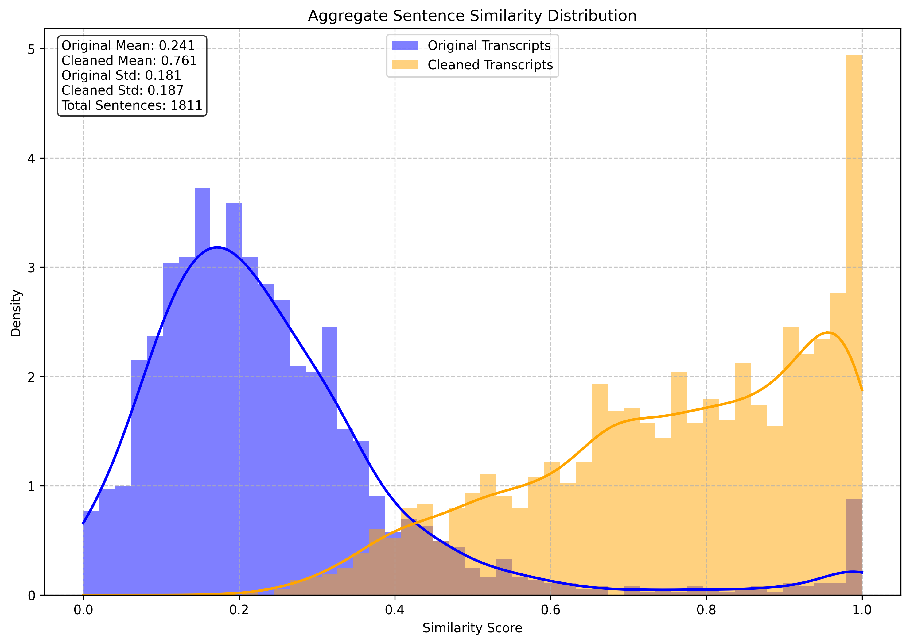

# YouTube Transcript Analysis

A Python tool that improves YouTube's auto-generated transcripts using DeepSeek LLM and compares these with high-quality Whisper transcriptions using semantic similarity with sentence-BERT model. The project's goal is to create high-quality transcripts that aren't as computationally expensive as Whisper.

## Results

### Aggregate Similarity Distribution


This plot shows the distribution of sentence-level similarities between Whisper and YouTube transcripts. The blue line represents the original YouTube transcripts (mean: 0.241), while the orange line represents the cleaned transcripts (mean: 0.761). Higher similarity scores indicate better alignment with the Whisper transcription. The average improvement is 39.99% for n=1811 sentences and 1,659 tokens per minute of video on average.

### Individual Analysis
Analysis for video sGUjmyfof4Q:
- Original similarity: 17.64%
- Cleaned similarity: 65.26%
- Improvement: 47.61%
- Total tokens used: 27,018

Analysis for video sNa_uiqSlJo:
- Original similarity: 25.42%
- Cleaned similarity: 81.78%
- Improvement: 56.35%
- Total tokens used: 38,903

Analysis for video x9Ekl9Izd38*:
- Original similarity: 86.81%
- Cleaned similarity: 71.85%
- Improvement: -14.96%
- Total tokens used: 14,912

Analysis for video w9WE1aOPjHc:
- Original similarity: 22.47%
- Cleaned similarity: 81.25%
- Improvement: 58.78%
- Total tokens used: 136,026

Analysis for video CSE77wAdDLg:
- Original similarity: 19.68%
- Cleaned similarity: 71.83%
- Improvement: 52.15%
- Total tokens used: 41,579

Notes:
- *It seems some youtube transcripts are significantly better than others.
- The sample size is probably too small.
- Similarity distributions for individual videos are in the plots/ folder.
- I need to see how big I can make the chunks before quality drops off to reduce API calls.

## Features

- Downloads audio from YouTube videos
- Generates high-quality transcriptions using OpenAI's Whisper model
- Fetches YouTube's auto-generated transcripts
- Chunks and iteratively improves transcript quality using DeepSeek LLM
- Compares transcripts using semantic similarity analysis with SBERT
- Generates individual similarity distribution plots for each video
- Creates aggregate similarity distribution plots across all processed videos
- Supports batch processing of multiple videos
- Caches results to avoid reprocessing

## Requirements

- Python 3.8+
- FFmpeg (for audio processing)
- CUDA-compatible GPU (optional, for faster transcription)

## Installation

1. Clone the repository:
```bash
git clone https://github.com/brickbrycebrick/transcript_cleaner.git
cd youtube_summary
```

2. Create and activate a virtual environment:
```bash
python -m venv env
source env/bin/activate  # On Windows: env\Scripts\activate
```

3. Install dependencies:
```bash
pip install -r requirements.txt
```

4. Create a `.env` file with your API keys:
```
DEEPSEEK_API_KEY=your_api_key_here
```

## Project Structure

```
youtube_summary/
├── data/
│   ├── audios/                # Downloaded audio files
│   ├── transcriptions/        # Whisper transcriptions
│   └── summary_transcripts/   # Processed YouTube transcripts
├── plots/                     # Similarity distribution plots
├── ytsummary/
│   ├── analysis.py           # Transcript comparison and visualization
│   ├── cleaner.py           # Transcript cleaning using AI
│   ├── yt_summary.py        # YouTube transcript processing
│   └── yt_transcriber.py    # Whisper transcription logic
├── run.py                    # Main pipeline orchestration
├── .env                      # API keys and configuration
├── .gitignore               # Git ignore rules
└── requirements.txt         # Python dependencies
```

## Usage

1. Process videos through the entire pipeline:
```python
from run import Pipeline
import asyncio

async def main():
    video_urls = [
        "https://www.youtube.com/watch?v=example1",
        "https://www.youtube.com/watch?v=example2"
    ]
    
    pipeline = Pipeline()
    results = await pipeline.process_videos(video_urls)

if __name__ == "__main__":
    asyncio.run(main())
```

This will:
- Check for existing transcripts and process missing ones
- Generate similarity analysis for each video
- Create individual similarity distribution plots
- Generate an aggregate similarity plot
- Print summary statistics

2. Run analysis only:
```python
from ytsummary.analysis import TranscriptAnalyzer

analyzer = TranscriptAnalyzer()
results = analyzer.analyze_transcripts()
```

3. Just transcribe videos:
```python
from ytsummary.yt_transcriber import YouTubeTranscriber
import asyncio

async def main():
    transcriber = YouTubeTranscriber()
    results = await transcriber.transcribe_videos([
        "https://www.youtube.com/watch?v=example"
    ])

if __name__ == "__main__":
    asyncio.run(main())
```

## Output Files

The tool generates several types of output files:
- `data/summary_transcripts/{video_id}.json`: Contains original and cleaned YouTube transcripts
- `data/transcriptions/{video_id}.json`: Contains Whisper transcriptions
- `plots/similarity_distribution_{video_id}.png`: Individual video similarity plots
- `plots/aggregate_similarity_distribution.png`: Combined similarity analysis across all videos

## Notes

- Transcriptions are cached in their respective directories
- Audio files are saved in the `data/audios` directory
- The tool skips processing if a transcription already exists
- GPU acceleration is used automatically if available for Whisper transcription
- Similarity plots show distribution of sentence-level similarities
- The aggregate plot combines data from all processed videos
